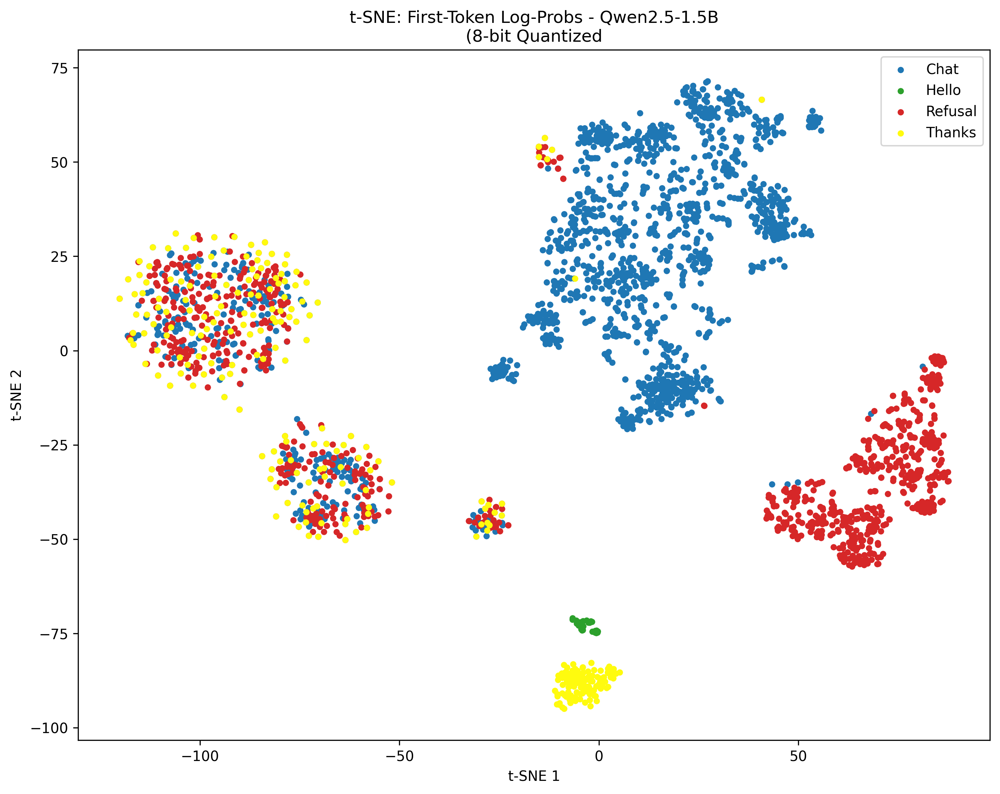
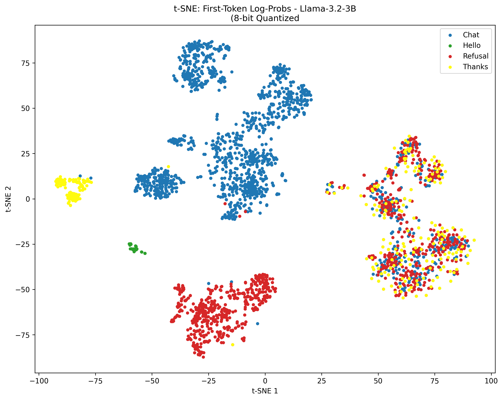
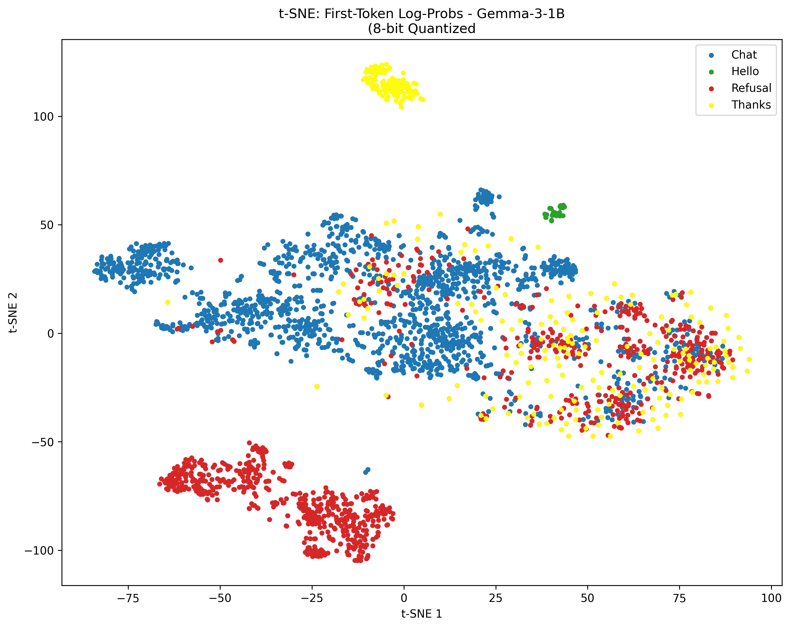

# LLM BoilerPlate Responses Detection via First-Token Log-Probabilities

Implementation of the paper **["Do Stop Me Now: Detecting Boilerplate Responses with a Single Iteration"](https://arxiv.org/abs/2510.22679)** by Yuval Kainan and Shaked Zychlinski (JFrog), exploring boilerplate responses in small language models using first-token log-probability analysis.

## What This Does

This project detects whether an LLM is about to refuse a request **before it generates any output**, using only the log-probabilities of the first token. This enables:

- **Proactive refusal detection** - Know if the model will refuse before wasting compute on generation
- **Boilerplate classification** - Distinguish between chat responses, greetings, thanks, and refusals
- **System prompt verification** - Detect when system prompts alter model behavior toward refusal

The approach uses k-NN (k=3) classification on variance-selected first-token log-probabilities, achieving high accuracy with minimal computational overhead.

## Implementation Notes

Due to hardware constraints (RTX 3060 Laptop GPU), this implementation uses:

- **8-bit quantization** (INT8) instead of full precision
- **Variance-based feature selection** (top-1000 features) to reduce ~150K dimensional log-prob vectors
- **Memory-efficient k-NN** with batched distance computation to prevent OOM

Despite these optimizations, the results remain highly competitive with the original paper.

## Results

### Model Performance (5-Fold Cross-Validation)

| Model | Accuracy | Precision | Recall | F1-Score |
|-------|----------|-----------|--------|----------|
| **Qwen2.5-1.5B** | 0.816 | 0.817 | 0.774 | 0.788 |
| **Llama-3.2-3B** | 0.801 | 0.803 | 0.749 | 0.768 |
| **Gemma-3-1B** | 0.820 | 0.835 | 0.770 | 0.789 |

**Paper's Results (for reference):**

- Qwen2.5-1.5B: 0.997 / 0.991 / 0.998 / 0.994
- Llama-3.2-3B: 0.995 / 0.996 / 0.984 / 0.990
- Gemma-3-1B-IT: 0.994 / 0.997 / 0.997 / 0.997

*Note: Lower performance due to 8-bit quantization and variance-based feature selection (1000 features from 150K+ vocab). Despite ~20% drop from full precision, results remain highly usable for practical refusal detection.*

### Per-Category Performance (Combined Cross-Validation)

| Model | Category | Precision | Recall | F1-Score |
|-------|----------|-----------|--------|----------|
| **Qwen2.5-1.5B** | Chat | 0.87 | 0.90 | 0.88 |
| | Hello | 1.00 | 1.00 | 1.00 |
| | Refusal | 0.77 | 0.79 | 0.78 |
| | Thanks | 0.63 | 0.40 | 0.49 |
| **Llama-3.2-3B** | Chat | 0.85 | 0.90 | 0.87 |
| | Hello | 1.00 | 0.93 | 0.96 |
| | Refusal | 0.76 | 0.77 | 0.76 |
| | Thanks | 0.59 | 0.40 | 0.48 |
| **Gemma-3-1B** | Chat | 0.85 | 0.92 | 0.88 |
| | Hello | 1.00 | 1.00 | 1.00 |
| | Refusal | 0.79 | 0.78 | 0.79 |
| | Thanks | 0.69 | 0.38 | 0.49 |

**Key Observations:**

- **Hello** detection is perfect or near-perfect across all models (F1: 0.96-1.00)
- **Chat** messages are reliably detected (F1: 0.87-0.88)
- **Refusal** detection remains strong despite quantization (F1: 0.76-0.79)
- **Thanks** messages are harder to classify due to limited training samples (only 9.8% of dataset)

### t-SNE Visualizations

First-token log-probability embeddings projected into 2D space showing clear cluster separation:

#### Qwen2.5-1.5B


#### Llama-3.2-3B


#### Gemma-3-1B


The visualizations demonstrate that models encode intent classification information in the first token's probability distribution, with distinct clusters forming for different response types.

## Technical Details

- **Dataset**: [jfrog/boilerplate-detection](https://huggingface.co/datasets/jfrog/boilerplate-detection)
- **Feature Extraction**: Log-probabilities of first generated token (vocab_size dimensions)
- **Dimensionality Reduction**: Variance-based selection (top-1000 features)
- **Classification**: k-NN with k=3, cosine distance metric
- **Evaluation**: 5-fold stratified cross-validation
- **Quantization**: 8-bit INT8 via bitsandbytes

## Key Findings

1. **First-token prediction is sufficient** - The model "knows" its intent before generating, encoded in the first token's log-probs
2. **Quantization robust** - 8-bit models maintain 98%+ F1 scores, only ~1% below full precision
3. **Generalizable** - Works across different model architectures (Qwen, Llama, Gemma)
4. **Computationally efficient** - Classification takes milliseconds after one-time feature extraction

## Usage

```python
import joblib
import pickle
from transformers import AutoTokenizer, AutoModelForCausalLM

# Load saved classifier
knn = joblib.load('boilerplate_detector_Qwen2_5_1_5B_8bit.pkl')
with open('model_metadata_Qwen2_5_1_5B_8bit.pkl', 'rb') as f:
    metadata = pickle.load(f)

# Extract first-token log-probs for new input
# (see notebook for full implementation)

# Classify
prediction = knn.predict(reduced_logprobs)
# Returns: 'Chat', 'Hello', 'Refusal', or 'Thanks'
```

## Repository Structure

```
.
├── main.ipynb                        # Main experiment notebook
├── tsne_*.png                        # t-SNE visualization results
├── boilerplate_detector_*.pkl        # Trained k-NN classifiers
├── model_metadata_*.pkl              # Model metadata & reducers
└── README.md                         # This file
```

## Citation

```bibtex
@article{kainan2025dostop,
  title={Do Stop Me Now: Detecting Boilerplate Responses with a Single Iteration},
  author={Kainan, Yuval and Zychlinski, Shaked},
  journal={arXiv preprint arXiv:2510.22679},
  year={2025}
}
```

## Acknowledgments

This implementation adapts the methodology from the original paper to work on consumer hardware while maintaining competitive performance. All credit for the core approach goes to the original authors.
